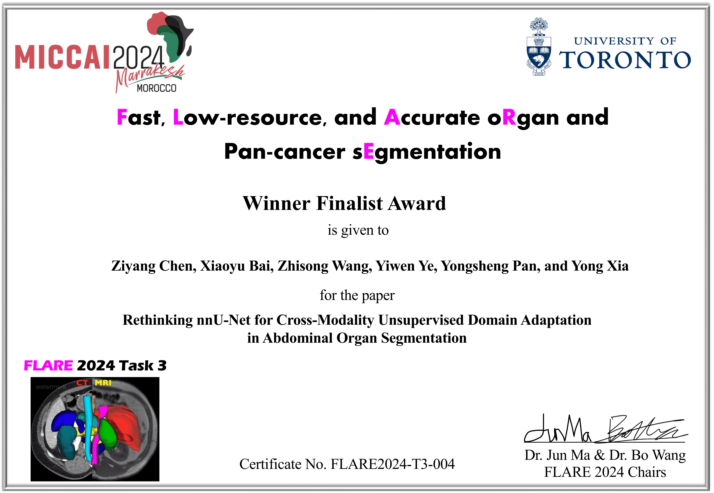

# :page_facing_up: TriLA: Triple-Level Alignment based Unsupervised Domain Adaptation for Joint Segmentation of Optic Disc and Optic Cup

🍺🍺🍺Cheers! Our TriLA won the "Winner Finalist Award" on the task3 of [MICCAI FLARE 2024](https://www.codabench.org/competitions/2296/). The detailed solution can be found in another [repository](https://github.com/Chen-Ziyang/FLARE2024-Task3).
<div align="center">
  
</div>

---

This is the official pytorch implementation of our IEEE JBHI 2024 paper "[TriLA: Triple-Level Alignment based Unsupervised Domain Adaptation for Joint Segmentation of Optic Disc and Optic Cup](https://ieeexplore.ieee.org/abstract/document/10540208)". In this paper, we propose a triple-level alignment based unsupervised domain adaptation method (TriLA) to achieve complete domain alignment.

<div align="center">
  
</div>

## Requirements
Python 3.7<br /> 
Pytorch 1.8.0

## Usage

### Installation
* Clone this repo
```
git clone https://github.com/Chen-Ziyang/TriLA.git
cd TriLA/TriLA-master
```

### Data Preparation
[RIGA+ Dataset](https://zenodo.org/record/6325549)

### How to Run
We take the scenario using BinRushed (source domain) and Base1 (target domain) as the example.
```
# Training
CUDA_VISIBLE_DEVICES=0 python main.py --mode train_DA --dataset_root YOUR_ROOT --Target_Dataset Base1 --Source_Dataset BinRushed \
--vae_coef 0.1 --output_coef 0.1 --style_coef 0.1 --content_coef 0.001
# Test
CUDA_VISIBLE_DEVICES=0 python main.py --mode test --reload EPOCH_OF_MODEL --load_time TIME_OF_MODEL --Target_Dataset BinRushed
```

### Acknowledgement
Part of the code is revised from the Pytorch implementation of [DoCR](https://github.com/ShishuaiHu/DoCR).

### Citation ✏️ 📄

If you find this repo useful for your research, please consider citing the paper as follows:
```
@article{chen2024trila,
  title={TriLA: Triple-Level Alignment based Unsupervised Domain Adaptation for Joint Segmentation of Optic Disc and Optic Cup},
  author={Chen, Ziyang and Pan, Yongsheng and Ye, Yiwen and Wang, Zhiyong and Xia, Yong},
  journal={IEEE Journal of Biomedical and Health Informatics},
  year={2024},
  publisher={IEEE}
}
```
